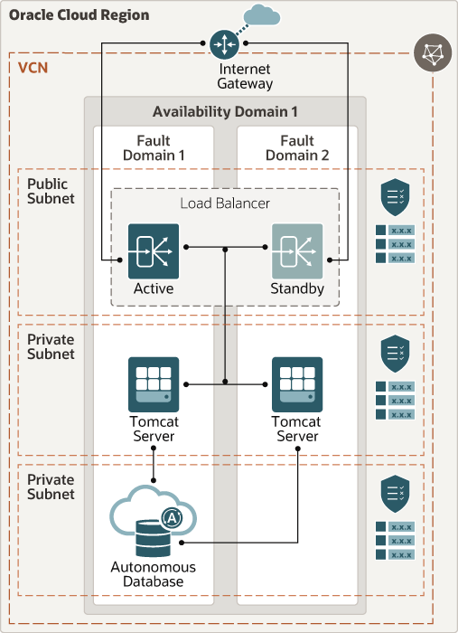

# Infrastructure setup for application deployemnt 
Apache Tomcat® is an open source Java application server. It implements the Java Servlet, JavaServer Pages, Java Expression Language and Java WebSocket technologies.
## Terraform Provider for Oracle Cloud Infrastructure
The OCI Terraform Provider is now available for automatic download through the Terraform Provider Registry. 
For more information on how to get started view the [documentation](https://www.terraform.io/docs/providers/oci/index.html) 
and [setup guide](https://www.terraform.io/docs/providers/oci/guides/version-3-upgrade.html).
* [Documentation](https://www.terraform.io/docs/providers/oci/index.html)
* [OCI forums](https://cloudcustomerconnect.oracle.com/resources/9c8fa8f96f/summary)
* [Github issues](https://github.com/terraform-providers/terraform-provider-oci/issues)
* [Troubleshooting](https://www.terraform.io/docs/providers/oci/guides/guides/troubleshooting.html)

## Clone the Module
Now, you'll want a local copy of this repo. You can make that with the commands:

    git clone https://github.com/oracle-quickstart/oci-arch-tomcat-autonomous.git
    cd oci-arch-tomcat-autonomous
    ls


## Prerequisites
First off, you'll need to do some pre-deploy setup.  That's all detailed [here](https://github.com/cloud-partners/oci-prerequisites).
Secondly, create a `terraform.tfvars` file and populate with the following information:
```
# Authentication
tenancy_ocid         = "<tenancy_ocid>"
user_ocid            = "<user_ocid>"
fingerprint          = "<finger_print>"
private_key_path     = "<pem_private_key_path>"
# SSH Keys
ssh_public_key       = "<public_ssh_key_path/key>"
ssh_private_key      = "<private_ssh_key_path>"
# Region
region               = "<oci_region>"
# Compartment
compartment_ocid     = "<compartment_ocid>"
````

Deploy:

    terraform init
    terraform plan
    terraform apply

## Add confirmation terraform screen here

## Testing your deployment
After the deployment is finished, you can test that your tomcat was deployed correctly and can access the database going to the urls:
````
http://<load balancer IP>/JDBCSample/JDBCSample_Servlet
http://<load balancer IP>/JDBCSample/UCPServlet
`````
## Destroy the Deployment
When you no longer need the deployment, you can run this command to destroy it:

    terraform destroy
    
## Tomcat-Autonomous Database Architecture



Although the diagram shows a private subnet for the Tomcat servers, the scripts are provisioning them on a public subnet as there is no bastion to allow access to the servers.


## Reference Architecture

- [Deploy Apache Tomcat connected to an autonomous database](https://docs.oracle.com/en/solutions/deploy-tomcat-adb)
 
## Data migration from on premise to ATP

1. Go to this link - https://www.oracle.com/in/database/technologies/instant-client/linux-x86-64-downloads.html and download Basic Package (ZIP) and SQL*Plus Package (ZIP)  - 19.8
	
2. Unzip both files

3. Set up LD_LIBRARY_PATH
	
       export LD_LIBRARY_PATH=/home/oracle/instantclient_19_8
	
4. Set up   TNS_ADMIN
	
       export TNS_ADMIN=/home/opc/work/instantclient_19_8/network/admin

5. Copy `tnsnames.ora` from Wallet_mydb to `Instantclient_19_8/network/admin/` folder

6. Copy `sqlnet.ora` from Wallet_mydb to `Instantclient_19_8/network/admin/` folder by modifying it as given below
		
		WALLET_LOCATION = (SOURCE = (METHOD = file) (METHOD_DATA = (DIRECTORY="<wallet path>/Wallet_mydb")))
		SSL_SERVER_DN_MATCH=yes
        
7. Cmd to login to ATP
	    
       ./sqlplus admin/@mydb_medium
	    SQL*Plus: Release 19.0.0.0.0 - Production on Tue Sep 29 11:15:02 2020
	    Version 19.8.0.0.0
	
	    Copyright (c) 1982, 2020, Oracle.  All rights reserved.
	
	    Enter password:
	    Last Successful login time: Sat Sep 26 2020 00:30:27 +00:00
	
	    Connected to:
	    Oracle Database 19c Enterprise Edition Release 19.0.0.0.0 - Production
	    Version 19.5.0.0.0
	
	    SQL> 
        
Copy data from dump file and past it on instant client console which will create riders user and give DWROLE to it. finally insert riders data to riders table and then do commit on it.
 	


## Migration of application from on premise to OCI cloud

1.	Do ssh to tomcat01 vm’s (refer to OCI console for vm’s public IP)

2.	Stop the tomcat by using below cmd

        sudo systemctl stop tomcat
     
3.	Copied SimpleDB.war to `/var/lib/tomcat/webapps/` dir

4.	Added configuration changes to server.xml,web.xml,context.xml files located under `/usr/share/tomcat/conf` dir 
 
 Add below tag parelle to GlobalNamingResources in Server.xml
 
    <GlobalNamingResources>
     <Resource name="jdbc/JDBCConnectionDS"
          global="jdbc/JDBCConnectionDS"
          auth="Container"
          type="javax.sql.DataSource"
          username="riders"
          password="Welcome#123456"
          driverClassName="oracle.jdbc.OracleDriver"
          description="RIDERS's database"
          url="jdbc:oracle:thin:@mydb_high?TNS_ADMIN=/etc/tomcat/wallet"
          maxActive="15"
          maxIdle="3"/>
    </GlobalNamingResources>
 
At last add below configuration to web.xml

       <resource-ref>
                <description>JDBCConnection</description>
                <res-ref-name>jdbc/JDBCConnectionDS</res-ref-name>
                <res-type>javax.sql.DataSource</res-type>
                <res-auth>Container</res-auth>
        </resource-ref>
 
Add below given config at last in context.xml

    <ResourceLink name="jdbc/JDBCConnectionDS"
        global="jdbc/JDBCConnectionDS"
        type="javax.sql.DataSource"/>
 
 
5.	Added lib `tomcat-dbcp-7.0.76.jar` to  `/usr/share/java/`

6.	Start Tomcat server using below given cmd:

        sudo systemctl start tomcat
       
7.	Test your application deployment at vm level using below given url:
    ````
       http://<IP>:<Port>/SimpleDB/
    ````
8.	Repeat the steps 1-7 for another tomcat vm as well.

9.	Once migration of SimpleDB war file done on both tomcat instance, you can validate end to end deployment using LB url 
    ````
       http://<Load balance IP>/SimpleDB/
    ````
